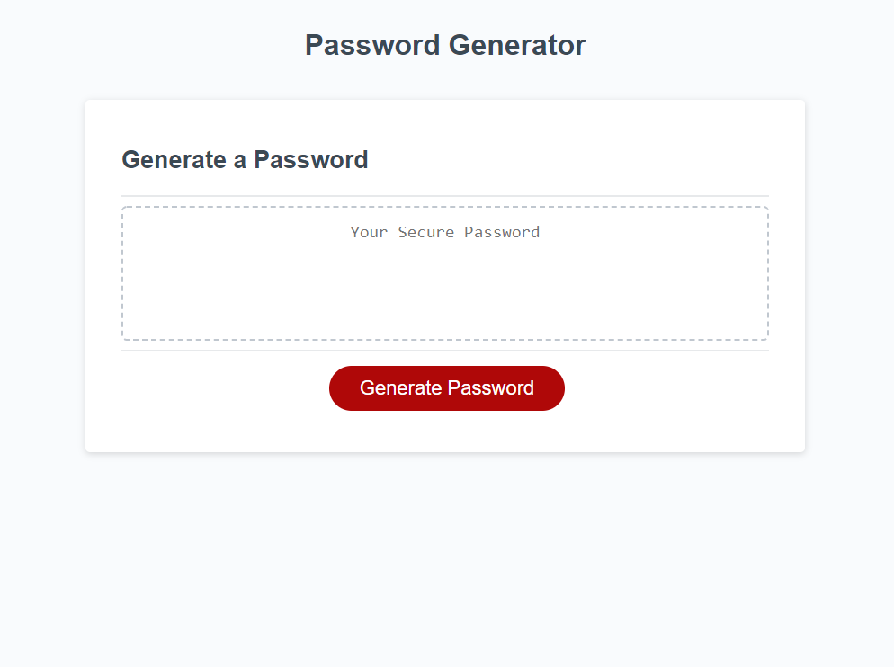

# Edward Beard Portfolio
=======
# Edward Beard

## Purpose
This website will provide a randomly generated password based on a selected number of characters betweeen 8 and 128 characters. User will be prompted on whether they would like to include Numbers, Special Characters, Lowercase & Uppercase letters. 

## Built With
* HTML
* CSS
* Javascript

## Features
This webisite was developed with the following features

* To get started click the Red Generate Password Button.
* Enter the number of Characters 
* You will then be prompted 4 times. The "Ok" button will include the requested characters. The "Cancel" button will not include the characters.
* Once complete, you will be provided a password that fits the selected criteria

## Website

## Contribution
Made with ❤️ by Edward Beard

